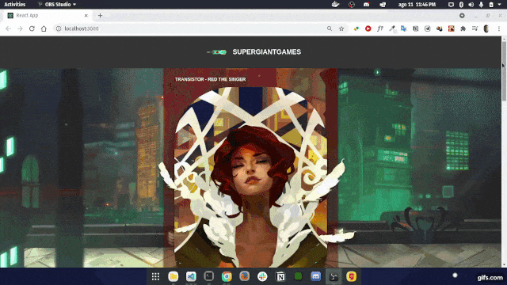

# Teste sorocaba.com

## Preview

<h1 align="center">
  
  
</h1>

## 💻 Project

Este projeto foi realizado durante o processo seletivo para a vaga de desenvolvedor front-end na empresa sorocaba.com.
<br />

É uma landing page simples para uma empresa de games fictíca, onde tenho a tela home, carrousel e o form.
<br />

## 🧬 Techologies

This project was developed using the following technologies:
 
- [React](https://pt-br.reactjs.org/)
- [Style-Components](https://styled-components.com/)
- [React-hook-form](https://react-hook-form.com/)
- [React-Slick](https://react-slick.neostack.com/)


## 🚀 Getting Started 

Clone the project and access the folder.
```bash
#Clone project
$ git clone https://github.com/evertonfxavier/test-socorabacom.git
```

Follow the steps below
```bash
#Install the dependecies 
$ npm install or yarn  
 
#Start projet
$ npm run start or yarn start
```

## 📝 License

This project is licensed under the MIT License. See the [LICENSE](https://github.com/evertonfxavier/test-socorabacom/blob/main/LICENSE.md) file for details
